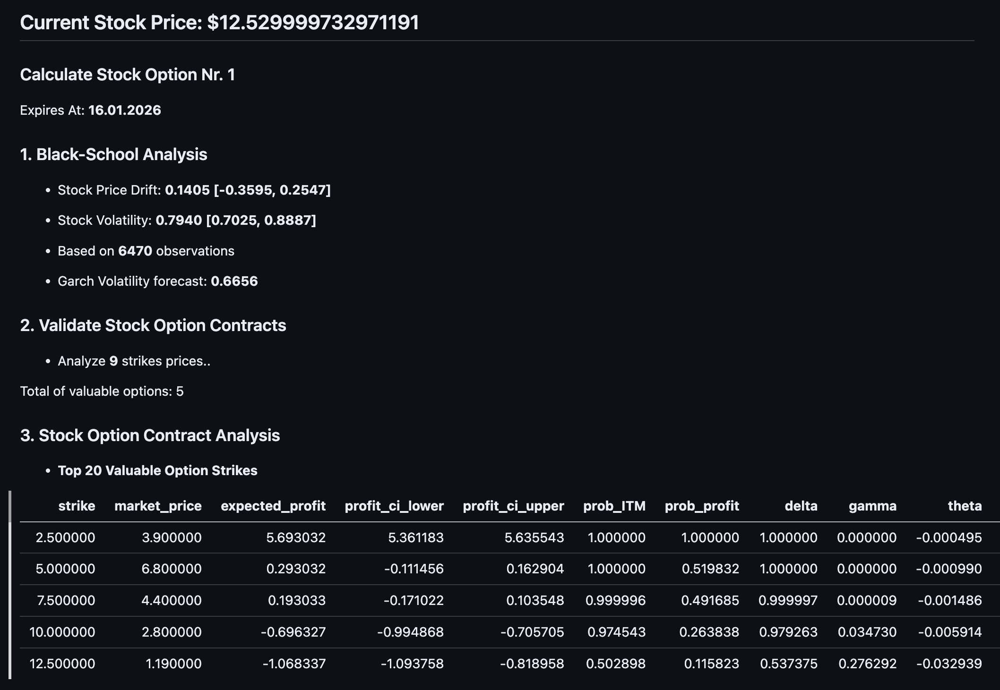
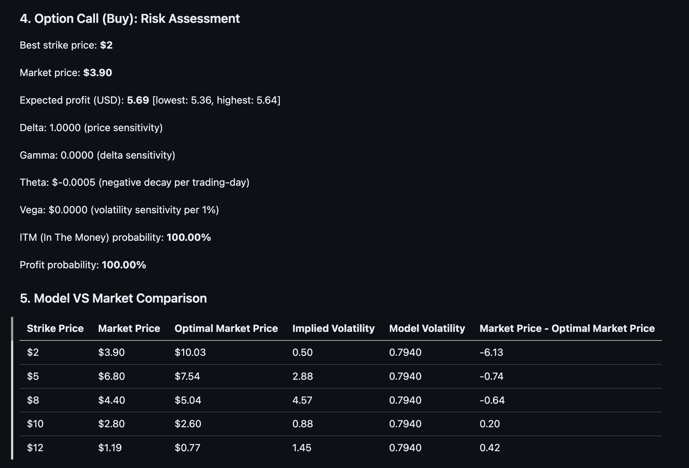
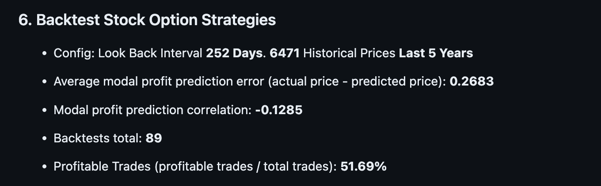

# Enhanced Stock Options Analysis Tool (Black–Scholes + GBM + GARCH)

This project is a **research-grade Python tool for analyzing call stock options** using a combination of:

- Black–Scholes–Merton (risk-neutral pricing)
- Physical-measure GBM forecasting (drift + volatility)
- Robust parameter estimation with confidence intervals
- GARCH(1,1) volatility forecasting
- Probability-of-profit ranking
- Liquidity-aware bid/ask adjustments
- Historical backtesting of forecast accuracy

The script evaluates **real option chains** (via `yfinance`) and ranks call options by **expected profit and probability of expiring profitably**, while explicitly separating **pricing models** from **forecasting models**.

---

## ⚠️ Important Disclaimers (READ FIRST)

### 1. **Market Data Limitation (Critical)**

`yfinance` **does NOT provide true real-time option market prices** and **does NOT reliably reflect actual bid/ask spreads**.

- Option prices may be delayed
- Bid/ask spreads may be stale or inaccurate
- Implied volatility may not reflect live market conditions

**All option prices in this tool must be treated as approximations only.**

### 2. **No Financial Advice**

This software is provided **for educational and research purposes only**.

- It is **NOT financial advice**
- It is **NOT investment advice**
- It is **NOT a trading recommendation**
- Past performance and backtests **do not guarantee future results**

You are fully responsible for any decisions made using this tool.

---

## Features Overview

- Robust drift (μ) and volatility (σ) estimation with confidence intervals
- Explicit separation of:
  - **Risk-neutral pricing** (Black–Scholes)
  - **Physical-measure forecasting** (GBM expectations)
- GARCH-based forward volatility forecasting
- Expected payoff modeling (closed-form, no Monte Carlo noise)
- Probability of:
  - Expiring in-the-money (ITM)
  - Expiring profitably (after total cost)
- Liquidity-aware effective pricing using bid/ask spreads
- Option Greeks (Delta, Gamma, Theta, Vega, Rho)
- Strategy backtesting on historical price data
- CSV + Markdown report output

---

## Project Structure

```

.
├── main.py                  # Main analysis script
├── utils.py                 # StockTicker abstraction & helpers
├── data/
│   └── call/
│       └── AAPL/
│           ├── enhanced_option_analysis_*.csv
│           ├── real_options_data_*.csv
│           └── backtest_results_*.csv
├── REPORT.md                # Auto-generated analysis report
└── requirements.txt

```

---

## Installation & Setup

### 1. Clone the Repository

```bash
git clone https://github.com/calipsow/option-analysis-tool.git
cd option-analysis-tool
```

### 2. Create a Virtual Environment (Recommended)

```bash
python3 -m venv .venv
source .venv/bin/activate
```

### 3. Install Dependencies

```bash
pip install -r requirements.txt
```

### Required Python Version

- **Python 3.10+**

---

## Dependencies

Core libraries used:

- `numpy`
- `pandas`
- `scipy`
- `matplotlib`
- `yfinance`
- `tabulate`

---

## How the Model Works (High Level)

1. **Historical stock prices** are used to estimate:

   - Log-return drift
   - GBM drift
   - Robust volatility (STD + MAD blend)

2. **Volatility forecast**:

   - Historical σ
   - Optional GARCH(1,1) forward volatility

3. **Option evaluation**:

   - Expected payoff under **physical GBM**
   - Market price under **risk-neutral Black–Scholes**
   - Liquidity-adjusted effective cost
   - Expected profit & confidence intervals
   - Probability of profitable expiry

4. **Ranking**:

   - Primary: Probability of profit
   - Secondary: Expected profit

---

## Running the Main Script

### Basic Usage

```bash
# Calculates call option profitability for an stock
python main.py --ticker AAPL --outfile CALL_OPTION_REPORT.md

# Calculates put option profitability for an stock
python put.py --ticker AAPL --outfile PUT_OPTION_REPORT.md
```

---

## Example Output Report







### 1. Markdown Report

- Saved as markdown
- Includes:

  - Parameter estimates
  - Option rankings
  - Risk metrics
  - Model vs market comparison
  - Backtest summary

### 2. CSV Files

Saved under:

```
data/call/<TICKER>/
```

Includes:

- Ranked option analysis
- Raw options data snapshot
- Backtest results (if available)

---

## Backtesting

The backtest:

- Uses rolling historical windows
- Forecasts expected returns
- Compares realized vs predicted outcomes
- Reports:

  - Prediction error
  - Correlation
  - Win rate

**Backtests validate model behavior — not profitability guarantees.**

---

## Key Assumptions & Limitations

- Assumes **exercise or liquidation at expiration**
- No early exercise modeling
- No transaction slippage beyond simple bid/ask modeling
- No margin, assignment, or portfolio effects modeled
- Equity markets assumed to follow GBM-like dynamics (approximation)

---

## License

MIT License — use, modify, and distribute freely, **at your own risk**.

---

## Final Note

This tool is designed for **quantitative exploration**, **model comparison**, and **educational insight** into options pricing vs forecasting.

It is intentionally conservative, explicit about assumptions, and defensive against overfitting — but **markets remain uncertain**.

Use responsibly.
